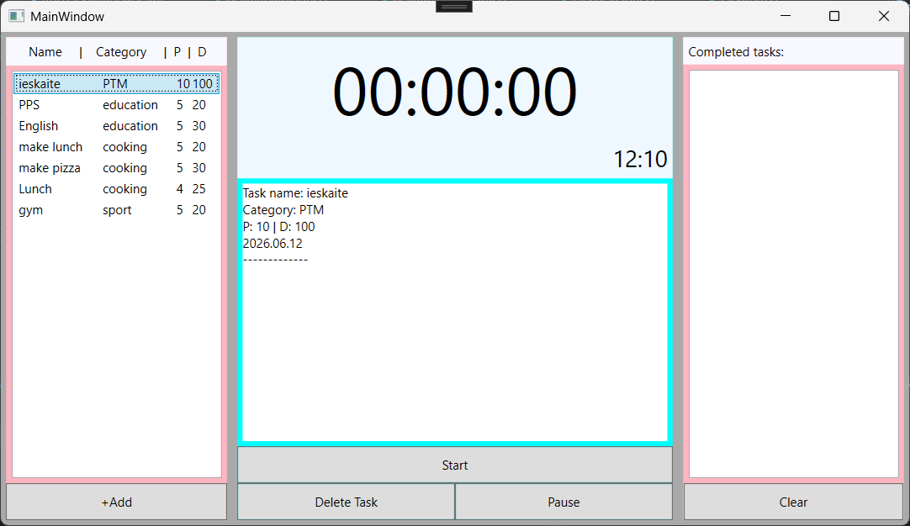
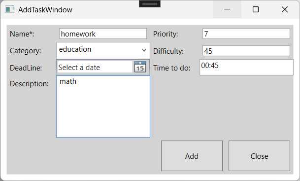

# Personal Time Manager

Personal Time Manager is a WPF desktop application written in C# for organizing personal tasks.

The application allows users to create tasks, group them by categories, automatically generate a schedule and track the execution time.

---

## Features

- Create and delete tasks
- Task categories
- Automatic task scheduling
- Priority and difficulty system
- Deadline support
- Built-in task timer
- Pause / Resume timer
- Completed task history
- SQLite database
- Automatic data persistence

---

## Automatic Scheduling

The application contains a custom scheduling algorithm.

Tasks are grouped into 100-minute category blocks.

Inside every block tasks are sorted by:

1. Deadline
2. Priority
3. Difficulty

If a task has no estimated duration, the algorithm assumes 25 minutes.

---

## Technologies

- C#
- .NET 9
- WPF
- MVVM
- Entity Framework Core
- SQLite
- LINQ

---

## Project structure

TimeManager.App
UI layer

TimeManager.Core
Business logic

TimeManager.Data
Database layer

TimeManager.Tests
Unit tests

---

## Screenshots

---

## Future improvements

- Task editing
- Statistics
- Calendar view
- Notifications